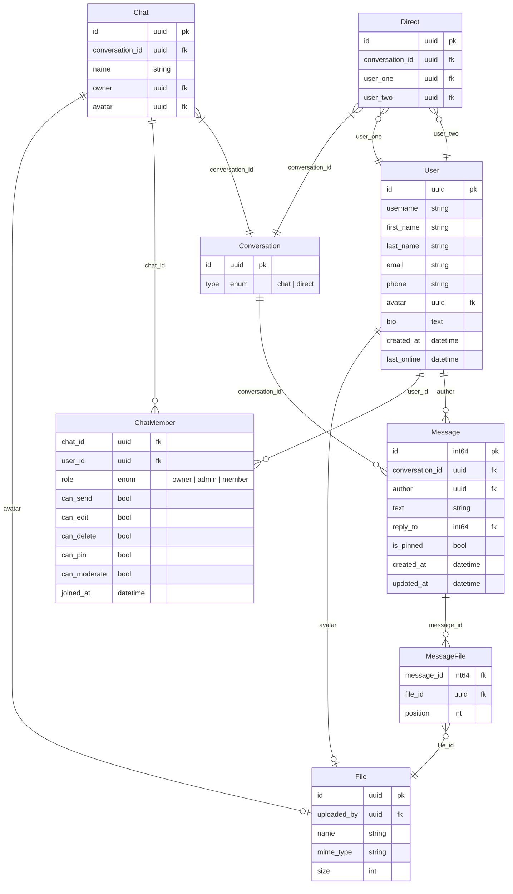

# DevChat

Простой веб-мессенджер

> [!WARNING]
> This is a WIP project, anything can be changed and/or broken without any notification beforehand

## Технологии

### Фронтэнд

- HTML + CSS
- [Vanilla JS SPA](https://github.com/zathio/vanilla-spa)
- RESTful API + WebSockets

### Бэкэнд

- FastAPI + WebSockets
- SQLModel + Alembic
- AioSQLite

## Запуск проекта

### Фронтэнд

```bash
bun run dev
```

### Бэкэнд

```bahs
uv run python src/main.py
```

### Docker

Полный запуск проекта в docker контейнере ещё находится в разработке

## Структура БД



## Список ToDo:
- [x] Планирование и структура проекта
  - [x] ER-диаграмма
  - [x] Технологии
  - [x] Дизайн
- [ ] Сборка в docker
- [ ] Базовый фронтэнд
  - [ ] Страницы
    - [ ] Главная
    - [ ] Авторизация
    - [ ] Регистрация
    - [ ] Профиль
    - [ ] Настройки
    - [ ] Список чатов
    - [ ] Личные сообщения
    - [ ] Групповой чат
  - [ ] Логика работы
    - [ ] Поиск пользователей
    - [ ] Отправка сообщения
    - [ ] Изменение сообщения
    - [ ] Удаление сообщения
    - [ ] Получение списка сообщений
    - [ ] Получение уведомлений
    - [ ] Присоединение к группе
    - [ ] Удаление из группы
    - [ ] Управление правами пользователя
    - [ ] Изменение настроек
- [ ] Базовый бэкэнд
  - [ ] Эндпоинты
    - [ ] Проверка версии и работоспособности
    - [ ] Регистрация, авторизация и CAPTCHA
    - [ ] Отправка страниц фронтэнда
    - [ ] Обработка статики
  - [ ] События сокета
    - [ ] Изменение профиля
    - [ ] Поиск пользователей
    - [ ] Отправка сообщения
    - [ ] Изменение сообщения
    - [ ] Удаление сообщения
    - [ ] Присоединение к группе
    - [ ] Удаление из группы
    - [ ] Управление правами пользователя
- [ ] Миграции базы данных
